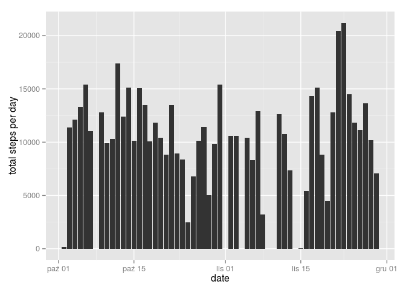
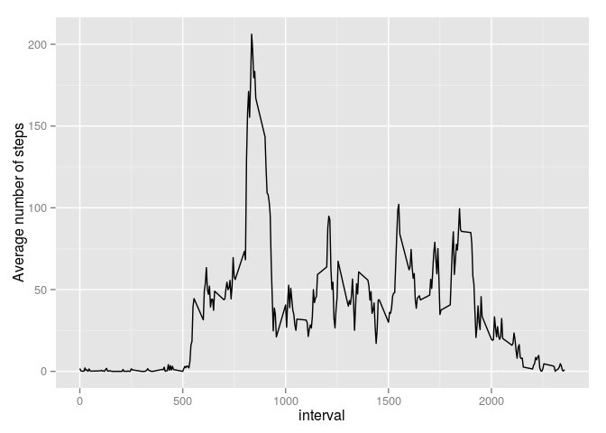
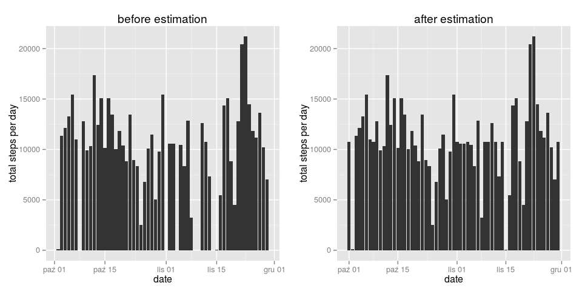
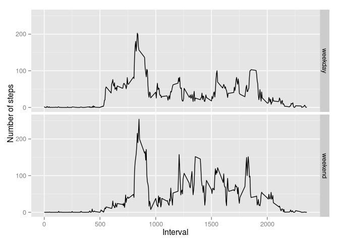

# Reproducible Research: Peer Assessment 1


## Loading and preprocessing the data


```r
activity <- read.csv(file = 'activity.csv',header = T)
activity$date <- as.Date(activity$date)
```


## What is mean total number of steps taken per day?

### Histogram of the total number of steps taken per day


```r
library(Rmisc)
library(dplyr)
library(ggplot2)
summary.total.steps <- group_by(activity,date) %>% summarize(total.steps = sum(steps))
hist.1 <- ggplot(aes(x=date,y=total.steps),data = summary.total.steps) + geom_histogram(stat='identity') + labs(y = 'total steps per day')
hist.1
```

 

### Mean and median total number of steps taken per day


```r
mean(summary.total.steps$total.steps, na.rm = TRUE)
```

```
## [1] 10766.19
```

```r
median(summary.total.steps$total.steps, na.rm = TRUE)
```

```
## [1] 10765
```

## What is the average daily activity pattern?

### Time series plot


```r
summary.interval <- group_by(activity,interval) %>% summarise(mean.steps = mean(steps,na.rm = TRUE))
ggplot(aes(x = interval, y = mean.steps), data = summary.interval) + geom_line() + labs(y='Average number of steps')
```

 

### Interval containing maximum average number of steps


```r
summary.interval[which.max(summary.interval$mean.steps),]
```

```
## Source: local data frame [1 x 2]
## 
##   interval mean.steps
##      (int)      (dbl)
## 1      835   206.1698
```

## Imputing missing values

### Total number of rows containing missing values


```r
apply(activity,1,is.na) %>% sum()
```

```
## [1] 2304
```

### Estimating missing values by substituting NA with mean value for interval


```r
estimate <- function(data, estimator) {
    if (is.na(data[1,1])) {
        data[1,1] <- estimator[which(estimator$interval==data[1,3]),2]
    }
    data
}
```
### Estimation procedure
 

```r
activity.estimated <- activity
for (i in 1:dim(activity)[1]) {
    activity.estimated[i,]<-estimate(data = activity.estimated[i,], estimator = summary.interval)
}
```

Before estimation:


```r
activity %>% head()
```

```
##   steps       date interval
## 1    NA 2012-10-01        0
## 2    NA 2012-10-01        5
## 3    NA 2012-10-01       10
## 4    NA 2012-10-01       15
## 5    NA 2012-10-01       20
## 6    NA 2012-10-01       25
```

After estimation:


```r
activity.estimated %>% head()
```

```
##       steps       date interval
## 1 1.7169811 2012-10-01        0
## 2 0.3396226 2012-10-01        5
## 3 0.1320755 2012-10-01       10
## 4 0.1509434 2012-10-01       15
## 5 0.0754717 2012-10-01       20
## 6 2.0943396 2012-10-01       25
```

### Histogram of the total number of steps taken per day - after estimation


```r
summary.total.steps.estimated <- group_by(activity.estimated,date) %>% summarize(total.steps = sum(steps))
hist.2 <- ggplot(aes(x=date,y=total.steps),data = summary.total.steps.estimated) + geom_histogram(stat='identity') + labs(y = 'total steps per day', title = 'after estimation')
hist.1 <- hist.1 + ggtitle('before estimation')
multiplot(hist.1,hist.2,cols=2)
```

```
## Warning: Removed 8 rows containing missing values (position_stack).
```

 

Mean and median before estimation:


```r
mean(summary.total.steps$total.steps, na.rm = TRUE)
```

```
## [1] 10766.19
```

```r
median(summary.total.steps$total.steps, na.rm = TRUE)
```

```
## [1] 10765
```

Mean and median after estimation:


```r
mean(summary.total.steps.estimated$total.steps, na.rm = TRUE)
```

```
## [1] 10766.19
```

```r
median(summary.total.steps.estimated$total.steps, na.rm = TRUE)
```

```
## [1] 10766.19
```

Mean after estimation does not differ from the value befor estimation due to the imputing method (mean). Also median value
 does not differ in a signifficant way.

## Are there differences in activity patterns between weekdays and weekends?


```r
library(lubridate, )
activity.weekdays <- mutate(activity.estimated,weekday = ifelse(wday(date)==6 | wday(date)==7,'weekend','weekday')) %>% group_by(interval, weekday) %>% summarise(mean.steps = mean(steps,na.rm = TRUE))
ggplot(aes(x=interval,y=mean.steps),data = activity.weekdays) + facet_grid(weekday ~ .) + geom_line() + labs(y='Number of steps',x='Interval')
```

 
